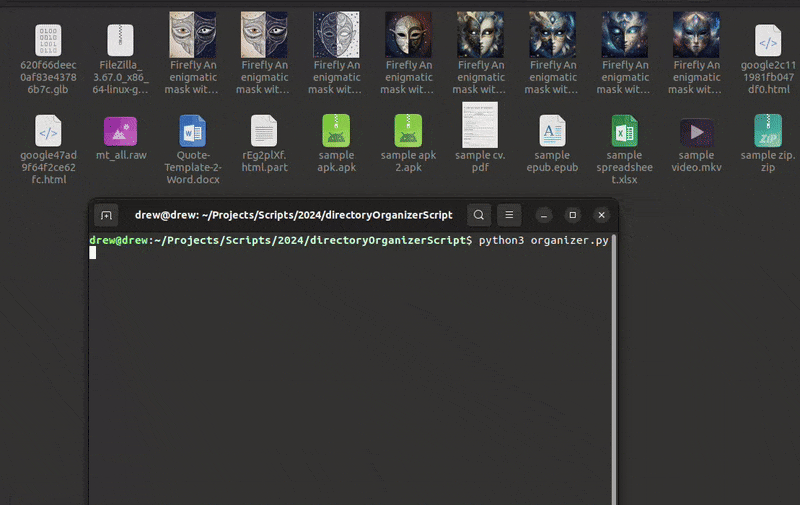
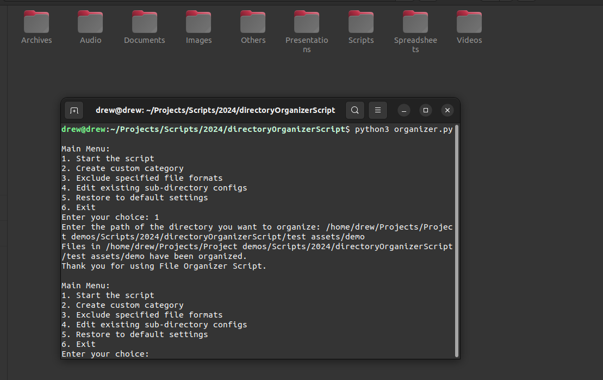
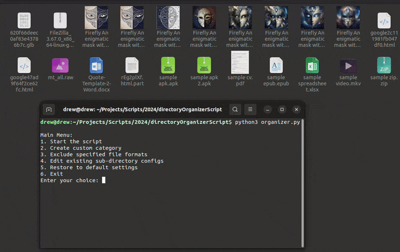
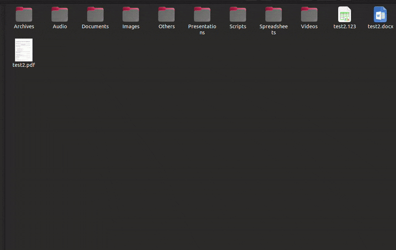

# Documentation

This Python script helps you organize files in a specified directory (e.g., Downloads) into appropriate folders such as Documents, Videos, Audio, etc. The script will create these folders if they do not exist and includes error handling. Additionally, it allows customization of categories, exclusion of specific file formats, and editing existing configurations.



## Table of Contents

1. **[Features](#features)**
2. **[Motivation](#motivation)**
3. **[Requirements](#requirements)**
4. **[Installation](#installation)**
5. **[Usage](#usage)**
    - **[Running the Script](#running-the-script)**
    - **[Creating Custom Categories](#creating-custom-categories)**
    - **[Excluding Specific File Formats](#excluding-specific-file-formats)**
    - **[Editing Existing Categories](#editing-existing-categories)**
    - **[Restoring Default Settings](#restoring-default-settings)**
6. **[Contributing](#contributing)**
7. **[License](#license)**
8. **[Social](#social)**

## Features

- Automatically organizes files into predefined categories.
- Creates folders if they do not exist.
- Includes error handling.
- Customizable file categories.
- Allows exclusion of specified file formats.
- Provides an option to edit existing categories.
- Option to restore default settings.

## Motivation

This project was created after trying multiple apps that claim to organize files but often have restrictions that require payments to access basic features. The goal was to create a convenient and free solution for organizing files. A desktop application will be ready in a short while to enhance this convenience further.

## Requirements

- Python 3.x

## Installation

1. **Clone the repository:**

    ```sh
    git clone https://github.com/TheSageAnomaly/directoryOrganizerScript.git
    cd directoryOrganizerScript
    ```

2. **Ensure you have Python 3 installed:**

    ```sh
    python --version
    ```

## Usage

### Running the Script

1. **Navigate to the directory containing the script:**

    ```sh
    cd directoryOrganizerScript
    ```

2. **Run the script:**

    ```sh
    python3 organizer.py
    ```

3. **Select an option from the main menu:**

    ```sh
    Main Menu:
    1. Start the script
    2. Create custom category
    3. Exclude specified file formats
    4. Edit existing sub-directory configs
    5. Restore to default settings
    6. Exit
    Enter your choice: 
    ```



### Creating Custom Categories

You can create custom categories directly from the console.

1. **Select option 2 from the main menu:**

    ```sh
    Main Menu:
    1. Start the script
    2. Create custom category
    3. Exclude specified file formats
    4. Edit existing sub-directory configs
    5. Restore to default settings
    6. Exit
    Enter your choice: 2
    ```

2. **Follow the prompts to enter the folder name and file extensions:**

    ```sh
    Enter the folder name (or * to go back): Ebooks
    Enter file extensions (separated by commas): .epub, .mobi
    ```

3. **The new category will be added and you'll be returned to the main menu.**



### Excluding Specific File Formats

You can exclude specific file formats from being organized.

1. **Select option 3 from the main menu:**

    ```sh
    Main Menu:
    1. Start the script
    2. Create custom category
    3. Exclude specified file formats
    4. Edit existing sub-directory configs
    5. Restore to default settings
    6. Exit
    Enter your choice: 3
    ```

2. **Follow the prompts to enter the file formats to exclude:**

    ```sh
    Enter file formats to exclude (separated by commas): .epub, .mkv
    Exclude the following file formats: ['.epub', '.mkv']? (yes/no): yes
    ```

3. **The specified formats will be excluded and you'll be returned to the main menu.**


### Editing Existing Categories

You can edit existing categories, including adding, editing, and removing file formats, and renaming folders.

1. **Select option 4 from the main menu:**

    ```sh
    Main Menu:
    1. Start the script
    2. Create custom category
    3. Exclude specified file formats
    4. Edit existing sub-directory configs
    5. Restore to default settings
    6. Exit
    Enter your choice: 4
    ```

2. **Follow the prompts to select the category to edit and make changes:**

    ```sh
    Existing Categories:
    1. Documents
    2. Videos
    3. Audio
    ...
    Select a folder to edit by number (or * to go back): 1
    
    Editing Category: Documents
    Current extensions: ['.pdf', '.doc', '.docx', '.txt', '.odt', '.rtf']
    1. Add new file formats
    2. Edit existing file formats
    3. Remove file formats
    4. Rename folder
    5. Go back
    Enter your choice: 1
    ```

3. **Make the desired changes and return to the main menu when done.**


### Restoring Default Settings

You can restore the script to its default settings, which will remove all custom configurations.

1. **Select option 5 from the main menu:**

    ```sh
    Main Menu:
    1. Start the script
    2. Create custom category
    3. Exclude specified file formats
    4. Edit existing sub-directory configs
    5. Restore to default settings
    6. Exit
    Enter your choice: 5
    ```

2. **Confirm the action:**
    ```sh

This will remove all custom sub-directory configurations and restore to default settings. Do you wish to proceed? (yes/no): yes
    ```

3. **The settings will be restored and you'll be returned to the main menu.**



###### note: you may have to reload the script for some changes to take effect,for example,restoring back to defaults

## Contributing

1. Fork the repository.
2. Create a new branch: `git checkout -b my-feature-branch`.
3. Make your changes and commit them: `git commit -m 'Add some feature'`.
4. Push to the branch: `git push origin my-feature-branch`.
5. Submit a pull request.

## License

This project is licensed under the MIT License - see the [License](License.md) file for details.

## Social

Follow me on [X (Twitter)](https://x.com/TheSageAnomaly) - handle: `@TheSageAnomaly`

## Call to Action

If you find this project useful, please star it on GitHub to show your support!
